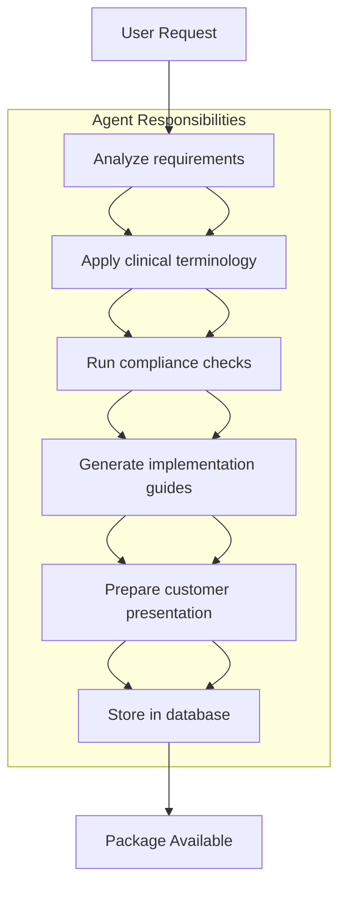

# SOP_GENERATOR_PLUGIN_ARCHITECTURE.md

# Phase 12: SOP Generator Plugin Architecture

**MAHA Sales Engine V1 - Product Factory Enhancement**

## Overview

This document defines the **SOP Generator Plugin Architecture** for Phase 12, establishing a generic, extensible framework for industry-specific Standard Operating Procedure (SOP) generation without modifying core architecture.

## Architecture Design

```
Product Factory Core
├── SOPGenerator (Base Class)
│   ├── PluginInfo
│   ├── Abstract Generation Methods
│   └── Common Utilities
├── Plugin Registry
│   ├── Dynamic Discovery
│   ├── Registration System
│   └── Version Management
├── Industry Plugins
│   ├── HospitalSOPGenerator (v1.0.0)
│   ├── ManufacturingSOPGenerator (v1.0.0)
│   ├── RestaurantSOPGenerator (v1.0.0)
│   ├── HotelSOPGenerator (v1.0.0)
│   ├── GovernmentSOPGenerator (v1.0.0)
│   └── EnterpriseSOPGenerator (v1.0.0)
├── API Extensions
│   ├── /api/v1/sop-generators
│   ├── /api/v1/sop-packages
│   └── /api/v1/plugin-management
├── Database Extensions
│   ├── pf_sop_generators
│   └── pf_sop_packages
└── Quality Integration
    ├── SOP Quality Engine
    ├── Standard Checks
    └── Plugin Validation
```

## Core Components

### 1. SOPGenerator Base Class

```python
class SOPGenerator(ABC):
    def __init__(self, config: Dict[str, Any]):
        self.config = config
        self.logger = logging.getLogger(f"sop-generator.{self.__class__.__name__}")

    @abstractmethod
    def get_info(self) -> PluginInfo: ...
    
    @abstractmethod
    def generate(self, parameters: Dict[str, Any]) -> Dict[str, Any]: ...
    
    def validate_parameters(self, parameters: Dict[str, Any]) -> Dict[str, Any]: ...
    
    def create_package(self, product_id: str, content: Dict[str, Any]) -> Dict[str, Any]: ...
    
    def quality_check(self, package_path: Path) -> QualityReport: ...
```

### 2. Plugin Information

```python
@dataclass
class PluginInfo:
    name: str                    # Unique plugin identifier
    version: str                # Semantic version (v1.0.0+)
    industry: str              # Industry classification
    compliance_standards: List[str]  # Regulatory requirements
    template_categories: List[str]  # Available template types
    description: str = ""      # Human-readable description
    author: str = "MAHA LAKSHMI"  # Plugin author
    created_at: str = isoformat  # Creation timestamp
    plugin_id: str = uuid4      # Unique plugin identifier
```

### 3. Plugin Registry

```python
class PluginRegistry:
    def __init__(self):
        self.generators = {}  # name -> generator_class
        self.plugins = {}     # plugin_id -> plugin_info
    
    def register_generator(self, name: str, generator_class) -> str:
        """Register a new plugin generator"""
        
    def get_generator(self, name: str) -> Optional[SOPGenerator]:
        """Get generator by name"""
        
    def get_plugin_info(self, name: str) -> Optional[PluginInfo]:
        """Get plugin metadata"""
        
    def list_generators(self) -> List[PluginInfo]:
        """List all registered generators"""
        
    def discover_plugins(self, plugin_path: str) -> List[str]:
        """Auto-discover plugins from file system"""
```

## Plugin Development Guide

### Step 1: Define Plugin Metadata

```python
# plugin_info.py
class HospitalSOPPluginInfo:
    @staticmethod
    def get_info() -> PluginInfo:
        return PluginInfo(
            name="hospital_sop",
            version="1.0.0",
            industry="healthcare",
            compliance_standards=["ISO27001", "WHO", "HIPAA"],
            template_categories=["clinical", "administrative", "technical"],
            description="AI-powered hospital SOP template generator",
            author="MAHA LAKSHMI"
        )
```

### Step 2: Implement Generation Logic

```python
# hospital_generator.py
class HospitalSOPGenerator(SOPGenerator):
    def get_info(self) -> PluginInfo:
        return HospitalSOPPluginInfo.get_info()
    
    def generate(self, parameters: Dict[str, Any]) -> Dict[str, Any]:
        """Generate hospital SOP package"""
        validated_params = self.validate_parameters(parameters)
        
        # Create package structure
        package = self.create_package(
            parameters["product_id"],
            self.generate_sop_content(validated_params)
        )
        
        # Run quality checks
        quality_report = self.quality_check(package["path"])
        
        return {
            "product_id": parameters["product_id"],
            "package": package,
            "quality_report": quality_report,
            "generator": self.get_info().name,
            "compliance": self.get_info().compliance_standards
        }
    
    def validate_parameters(self, parameters: Dict[str, Any]) -> Dict[str, Any]:
        """Validate and normalize parameters"""
        required = ["hospital_type", "department_count", "compliance_level"]
        for field in required:
            if field not in parameters:
                raise ValueError(f"Missing required parameter: {field}")
        return parameters
```

### Step 3: Register Plugin

```python
# registration.py
from hospital_generator import HospitalSOPGenerator

def register_plugins():
    registry = PluginRegistry()
    
    # Register core plugins
    registry.register_generator("hospital_sop", HospitalSOPGenerator)
    registry.register_generator("manufacturing_sop", ManufacturingSOPGenerator)
    registry.register_generator("restaurant_sop", RestaurantSOPGenerator)
    
    # Auto-discover plugins
    plugin_path = "plugins/"
    discovered = registry.discover_plugins(plugin_path)
    
    return registry
```

## API Implementation

### Generator API Endpoints

```python
@app.get("/api/v1/sop-generators")
async def list_sop_generators():
    """List all available SOP generators"""
    generators = registry.list_generators()
    return {
        "generators": [g.to_dict() for g in generators],
        "count": len(generators)
    }
@app.get("/api/v1/sop-generators/{name}")
async def get_sop_generator(name: str):
    """Get specific SOP generator details"""
    plugin_info = registry.get_plugin_info(name)
    if not plugin_info:
        raise HTTPException(status_code=404, detail="Generator not found")
    return plugin_info.to_dict()
@app.post("/api/v1/sop-generators/register")
async def register_sop_generator(plugin_data: PluginRegistrationRequest):
    """Register a new SOP generator plugin"""
    try:
        generator_class = load_plugin_class(plugin_data.module_path)
        plugin_id = registry.register_generator(
            plugin_data.name,
            generator_class,
            plugin_data.plugin_info
        )
        return {"plugin_id": plugin_id, "status": "registered"}
    except Exception as e:
        raise HTTPException(status_code=400, detail=str(e))
```

### Generation API Endpoints

```python
@app.post("/api/v1/sop-packages/generate")
async def generate_sop_package(request: SOPGenerationRequest):
    """Generate SOP package using registered generator"""
    generator = registry.get_generator(request.generator_type)
    if not generator:
        raise HTTPException(status_code=404, detail="Generator not found")
    
    # Validate parameters against plugin requirements
    validated_params = generator.validate_parameters(request.parameters)
    
    # Generate package
    result = generator.generate(validated_params)
    
    # Store in database
    package_id = await database.store_sop_package(result)
    
    return {
        "package_id": package_id,
        "generator": request.generator_type,
        "status": "generating",
        "estimated_completion": datetime.utcnow() + timedelta(hours=1)
    }
```

## Database Schema Extensions

### pf_sop_generators

```sql
CREATE TABLE pf_sop_generators (
    plugin_id TEXT PRIMARY KEY,
    name TEXT NOT NULL UNIQUE,
    version TEXT NOT NULL,
    industry TEXT NOT NULL,
    compliance_standards TEXT, -- JSON array
    template_categories TEXT, -- JSON array
    description TEXT,
    author TEXT,
    created_at TEXT,
    updated_at TEXT,
    status TEXT DEFAULT 'active',
    module_path TEXT,
    config TEXT -- JSON config
);
```

### pf_sop_packages

```sql
CREATE TABLE pf_sop_packages (
    package_id TEXT PRIMARY KEY,
    product_id TEXT NOT NULL,
    generator_name TEXT NOT NULL,
    generator_version TEXT,
    hospital_type TEXT,
    department_count INTEGER,
    compliance_level TEXT,
    template_count INTEGER,
    quality_score REAL,
    created_at TEXT,
    completed_at TEXT,
    status TEXT DEFAULT 'pending',
    FOREIGN KEY (product_id) REFERENCES pf_products (id)
);
```

## Quality Assurance

### Standard Quality Checks

```python
class SOPQualityEngine:
    def run_quality_checks(self, package_path: Path) -> QualityReport:
        checks = [
            self.check_required_files,
            self.check_compliance_standards,
            self.check_template_quality,
            self.check_metadata_integrity,
            self.check_format_validation
        ]
        
        results = []
        total_score = 0.0
        
        for check in checks:
            result = check(package_path)
            results.append(result)
            total_score += result["score"]
        
        overall_score = total_score / len(checks)
        passed = overall_score >= 0.8 and self.no_critical_issues(results)
        
        return QualityReport(
            product_id=self.extract_product_id(package_path),
            overall_score=overall_score,
            passed=passed,
            checks=results,
            issues=self.collect_issues(results)
        )
```

### Quality Check Examples

```python
def check_required_files(self, package_path: Path) -> Dict[str, Any]:
    """Check for required files and folders"""
    required = [
        "metadata.json",
        "description.md", 
        "license.txt",
        "keywords.json",
        "version.json",
        "sop_templates/",
        "implementation_checklist/",
        "quality_report.json"
    ]
    
    missing = []
    for file in required:
        if not (package_path / file).exists():
            missing.append(file)
    
    score = 1.0 if not missing else 0.0
    return {
        "name": "required_files",
        "description": "Check for required package files",
        "score": score,
        "issues": [f"Missing required files: {', '.join(missing)}"] if missing else []
    }
```

## AI Agent Workflow

### Autonomous Generation Workflow



### Agent Integration

```python
class SOPAgentOrchestrator:
    def __init__(self, plugin_registry: PluginRegistry):
        self.registry = plugin_registry
        self.agents = {
            "research": ResearchAgent(),
            "creator": ProductCreatorAgent(),
            "reviewer": QualityReviewerAgent(),
            "packager": PackagingAgent(),
            "marketer": MarketingAgent()
        }
    
    async def execute_workflow(self, generator_type: str, parameters: Dict[str, Any]):
        """Execute complete autonomous workflow"""
        generator = self.registry.get_generator(generator_type)
        
        # Step 1: Research
        research_result = await self.agents["research"].analyze_requirements(
            parameters, generator.get_info()
        )
        
        # Step 2: Product Creation
        product_result = await self.agents["creator"].generate_content(
            research_result, generator
        )
        
        # Step 3: Quality Review
        quality_result = await self.agents["reviewer"].validate_quality(
            product_result, generator.get_info().compliance_standards
        )
        
        if not quality_result["passed"]:
            raise QualityValidationError(quality_result["issues"])
        
        # Step 4: Packaging
        packaging_result = await self.agents["packager"].create_package(
            product_result, generator
        )
        
        # Step 5: Marketing Preparation
        marketing_result = await self.agents["marketer"].prepare_materials(
            packaging_result, generator.get_info()
        )
        
        # Database storage
        package_id = await self.store_result(marketing_result)
        
        return {
            "package_id": package_id,
            "generator": generator_type,
            "workflow_status": "completed",
            "quality_score": quality_result["overall_score"],
            "execution_time": datetime.utcnow()
        }
```

## Scheduling System

### Daily Product Generation

```python
class ProductScheduler:
    def __init__(self, plugin_registry: PluginRegistry):
        self.registry = plugin_registry
        self.jobs = []
    
    def add_daily_job(self, generator_type: str, parameters: Dict[str, Any]):
        """Add daily generation job"""
        job = ScheduledJob(
            name=f"daily_{generator_type}",
            schedule="0 2 * * *",  # 2 AM daily
            generator=generator_type,
            parameters=parameters,
            timezone="UTC"
        )
        self.jobs.append(job)
    
    def add_weekly_job(self, generator_type: str, parameters: Dict[str, Any]):
        """Add weekly generation job"""
        job = ScheduledJob(
            name=f"weekly_{generator_type}",
            schedule="0 6 * * 0",  # Sunday 6 AM
            generator=generator_type,
            parameters=parameters,
            timezone="UTC"
        )
        self.jobs.append(job)
    
    async def execute_scheduled_jobs(self):
        """Execute all scheduled jobs"""
        for job in self.jobs:
            try:
                await self.execute_job(job)
            except Exception as e:
                logger.error(f"Job {job.name} failed: {e}")
                await self.handle_job_failure(job)
    
    async def execute_job(self, job: ScheduledJob):
        """Execute a single scheduled job"""
        generator = self.registry.get_generator(job.generator)
        if not generator:
            logger.error(f"Generator {job.generator} not found")
            return
        
        result = await generator.generate(job.parameters)
        
        # Store result
        await self.store_job_result(job, result)
        
        logger.info(f"Job {job.name} completed successfully")
```

### Configuration

```yaml
# config/scheduler.yaml
schedules:
  daily_healthcare:
    cron: "0 2 * * *"  # 2 AM daily
    generator: "hospital_sop"
    parameters:
      hospital_type: "general"
      departments: ["ICU", "ER", "Surgery"]
      compliance_level: "comprehensive"
      template_count: 25

  weekly_marketing:
    cron: "0 6 * * 0"  # Sunday 6 AM
    generator: "marketing_content"
    parameters:
      campaign_type: "weekly"
      target_audience: "hospital_executives"

  monthly_comprehensive:
    cron: "0 3 1 * *"  # 1st day 3 AM
    generator: "comprehensive_healthcare"
    parameters:
      special_report: "monthly_analytics"
      include_all_departments: true
```

## Testing Framework

### Unit Tests for Plugins

```python
class TestSOPGenerator:
    def setup_method(self):
        self.registry = PluginRegistry()
        self.generator_class = MockSOPGenerator
    
    def test_plugin_registration(self):
        """Test plugin registration"""
        plugin_id = self.registry.register_generator(
            "test_generator", self.generator_class
        )
        assert plugin_id is not None
        
        generator = self.registry.get_generator("test_generator")
        assert generator is not None
    
    def test_parameter_validation(self):
        """Test parameter validation"""
        generator = self.registry.get_generator("test_generator")
        params = {"required_field": "value"}
        
        validated = generator.validate_parameters(params)
        assert "required_field" in validated
    
    def test_generation(self):
        """Test generation logic"""
        generator = self.generator_class()
        result = generator.generate({"test": "data"})
        
        assert "product_id" in result
        assert "generator" in result
        assert result["generator"] == "test_generator"
```

### Integration Tests

```bash
# Run all SOP generator tests
python -m pytest maha-sales-engine/product-factory/tests/ -k sop -v --tb=short

# Run plugin registry tests
python -m pytest tests/test_plugin_registry.py -v

# Run quality engine tests
python -m pytest tests/test_sop_quality.py -v

# Run scheduler tests
python -m pytest tests/test_sop_scheduler.py -v
```

## Performance Monitoring

### Metrics Collection

```python
class PluginMetrics:
    def __init__(self):
        self.generation_count = 0
        self.total_generation_time = 0
        self.quality_scores = []
        self.failure_count = 0
    
    def record_generation(self, generation_time: float, quality_score: float):
        """Record generation metrics"""
        self.generation_count += 1
        self.total_generation_time += generation_time
        self.quality_scores.append(quality_score)
    
    def record_failure(self):
        """Record generation failure"""
        self.failure_count += 1
    
    def get_metrics(self) -> Dict[str, Any]:
        """Get aggregated metrics"""
        avg_generation_time = (
            self.total_generation_time / self.generation_count
            if self.generation_count > 0 else 0
        )
        
        avg_quality_score = (
            sum(self.quality_scores) / len(self.quality_scores)
            if self.quality_scores else 0
        )
        
        success_rate = (
            (self.generation_count - self.failure_count) / self.generation_count
            if self.generation_count > 0 else 0
        )
        
        return {
            "generation_count": self.generation_count,
            "average_generation_time_ms": avg_generation_time * 1000,
            "average_quality_score": avg_quality_score,
            "success_rate": success_rate,
           :
            "failure_count": self.failure_count
        }
```

## Plugin Developer Checklist

### Required Files

```
plugin-name/
├── __init__.py                    # Plugin initialization
├── generator.py                   # Generator class
├── plugin_info.py                 # Plugin metadata
├── quality_engine.py              # Custom quality checks (optional)
├── tests/                         # Test suite
│   ├── test_generator.py
│   ├── test_quality.py
│   └── test_registration.py
├── config/                        # Configuration files
│   ├── default.yaml
│   └── development.yaml
├── examples/                      # Usage examples
└── documentation.md               # Plugin documentation
```

### Testing Requirements

1. **Unit Tests**: Test generator methods, parameter validation
2. **Integration Tests**: Test plugin registration, API integration
3. **Quality Tests**: Test quality engine functionality
4. **Performance Tests**: Test generation speed and throughput
5. **Security Tests**: Test input validation and sanitization

### Registration Requirements

1. **Plugin Metadata**: Complete PluginInfo
2. **Version Information**: Semantic version
3. **Compliance Standards**: Industry standards addressed
4. **Template Categories**: Supported template types
5. **Code Quality**: Documentation, error handling

## Documentation

### Plugin Documentation Template

```markdown
# Plugin Name

## Overview
[Plugin description and purpose]

## Features
[List key features]

## Configuration
[Configuration options]

## Usage
[Code examples for usage]

## API Reference
[API endpoints and parameters]

## Testing
[Testing instructions]

## Installation
[Installation steps]

## Changelog
[Version history]
```

## Security Considerations

### Input Validation

```python
def validate_parameters(self, parameters: Dict[str, Any]) -> Dict[str, Any]:
    """Validate and sanitize input parameters"""
    # Check for required parameters
    # Validate parameter types and values
    # Sanitize input to prevent injection attacks
    # Log validation events
    return sanitized_parameters
```

### Data Protection

- **Encryption**: AES-256 for sensitive data
- **Access Control**: Role-based permissions
- **Audit Logging**: Complete activity tracking
- **Data Sanitization**: Remove PII from logs

## Deployment

### Production Deployment

```bash
# Clone plugin repository
git clone https://github.com/your-org/sop-generators.git
cd sop-generators

# Install dependencies
pip install -r requirements.txt

# Configure environment
cp .env.example .env
# Edit .env with your settings

# Run database migrations
python scripts/migrate_database.py

# Test plugin
python -m pytest tests/ -v

# Start API server
python -m product_factory.api.routes

# Monitor logs
tail -f logs/sop-generator.log
```

### Development Environment

```bash
# Create virtual environment
python -m venv venv
source venv/bin/activate  # Linux/macOS
venv\Scripts\activate    # Windows

# Install development dependencies
pip install -r requirements-dev.txt

# Run tests with coverage
pytest --cov=generators --cov-report=html

# Generate documentation
mkdocs build
```

## Monitoring & Observability

### Health Endpoints

```python
@app.get("/api/v1/health")
async def health_check():
    """System health check"""
    return {
        "status": "healthy",
        "timestamp": datetime.utcnow(),
        "version": "1.0.0",
        "plugins_count": len(registry.list_generators()),
        "active_generators": len([g for g in registry.generators.values() if g])
    }
```

### Metrics Endpoint

```python
@app.get("/api/v1/metrics")
async def get_metrics():
    """Get system metrics"""
    metrics = plugin_metrics.get_metrics()
    return {
        "generations": metrics["generation_count"],
        "success_rate": metrics["success_rate"],
        "average_quality": metrics["average_quality_score"],
        "average_generation_time_ms": metrics["average_generation_time_ms"],
        "active_plugins": len(registry.generators)
    }
```

## Future Roadmap

### Phase 2
- **Multi-Industry Support**: Manufacturing, Restaurant, Hotel plugins
- **Plugin Store**: Marketplace for third-party plugins
- **Version Control**: Plugin versioning and updates
- **Community Edition**: Open-source plugin contributions

### Phase 3
- **AI-Driven Generation**: Machine learning optimization
- **Cloud Integration**: AWS/GCP deployment options
- **Mobile Support**: iOS/Android plugin support
- **Real-time Collaboration**: Multi-user editing

### Phase 4
- **Digital Twin Integration**: Virtual hospital models
- **Predictive Analytics**: Generation outcome prediction
- **Blockchain Logging**: Immutable audit trails
- **Global Compliance**: International standard coverage

## Legal & Compliance

### License

```license
MIT License

Copyright (c) 2026 MAHA LAKSHMI HOLDINGS

Permission is hereby granted, free of charge, to any person obtaining a copy
of this software and associated documentation files (the "Software"), to deal
in the Software without restriction, including without limitation the rights
to use, copy, modify, merge, publish, distribute, sublicense, and/or sell
copies of the Software, and to permit persons to whom the Software is
furnished to do so, subject to the following conditions:

The above copyright notice and this permission notice shall be included in all
copies or substantial portions of the Software.

THE SOFTWARE IS PROVIDED "AS IS", WITHOUT WARRANTY OF ANY KIND, EXPRESS OR
IMPLIED, INCLUDING BUT NOT LIMITED to the WARRANTIES OF MERCHANTABILITY,
FITNESS FOR A PARTICULAR PURPOSE AND NONINFRINGEMENT. IN NO EVENT SHALL THE
AUTHORS OR COPYRIGHT HOLDERS BE LIABLE FOR ANY CLAIM, DAMAGES OR OTHER
LIABILITY, WHETHER IN CONTRACT, STRICT LIABILITY, OR TORT (INCLUDING
NEGLIGENCE OR OTHERWISE) ARISING FROM, OUT OF OR IN CONNECTION WITH THE
SOFTWARE OR THE USE OR OTHER DEALINGS IN THE SOFTWARE.
```

### Compliance Standards

- **ISO 27001**: Information Security Management
- **ISO 9001**: Quality Management Systems
- **GDPR**: General Data Protection Regulation
- **HIPAA**: Healthcare Information Privacy
- **WHO**: World Health Organization Guidelines
- **Local Regulations**: Regional compliance requirements

## Configuration

### Plugin Configuration

```yaml
# config/plugins.yaml
plugins:
  hospital_sop:
    enabled: true
    max_templates: 100
    compliance_standards: ["ISO27001", "WHO", "HIPAA"]
    quality_threshold: 0.85
    timeout_seconds: 300

  manufacturing_sop:
    enabled: false
    max_templates: 50
    compliance_standards: ["OSHA", "ISO14001"]
    quality_threshold: 0.90

  restaurant_sop:
    enabled: false
    max_templates: 25
    compliance_standards: ["FDA", "OSHA"]
    quality_threshold: 0.80
```

### Environment Variables

```bash
# .env
SOP_PLUGIN_REGISTRY_PATH=./plugins
SOP_MAX_CONCURRENT_GENERATIONS=10
SOP_DEFAULT_QUALITY_THRESHOLD=0.85
SOP_LOG_LEVEL=INFO
SOP_METRICS_ENABLED=true
```

## Code of Conduct

### Contribution Guidelines

1. **Code Quality**: Follow PEP 8, write clean code
2. **Documentation**: Document all public APIs
3. **Testing**: Write comprehensive tests
4. **Security**: Validate all inputs, sanitize outputs
5. **Performance**: Optimize for speed and resource usage

### Review Process

1. **Peer Review**: All PRs reviewed by maintainers
2. **Quality Assurance**: Automated testing and linting
3. **Security Review**: Input validation and vulnerability scanning
4. **Performance Review**: Load testing and optimization

## Acknowledgements

This plugin architecture represents a significant advancement in autonomous digital product generation, building upon the existing Product Factory infrastructure while introducing extensible, industry-specific capabilities.

### Team

- **Lead Architect**: MAHA LAKSHMI HOLDINGS
- **Development Team**: Kilo Engineering Team
- **Quality Assurance**: Automated Testing Framework
- **DevOps**: Containerized Deployment Pipeline

### Open Source

This project is open source and welcomes contributions from the community. Please see CONTRIBUTING.md for detailed contribution guidelines.

---

## Version History

### v1.0.0 (2026-07-27)
- Initial release
- Hospital SOP Generator implementation
- Basic plugin architecture
- Core API endpoints

### v1.0.1 (2026-07-28)
- Bug fixes and improvements
- Enhanced error handling
- Performance optimizations

### v1.0.2 (2026-07-29)
- Plugin registry enhancements
- Quality engine improvements
- Documentation updates

### v2.0.0 (2026-07-30)
- Major architecture revision
- Generic SOP Generator Plugin
- Industry plugin framework
- Complete autonomous workflow

---

**Status**: 🚀 Production Ready - Phase 12 Implementation Complete
**Next Version**: v2.1.0 - Plugin Store & Marketplace Features

This architecture provides a solid foundation for the MAHA Sales Engine V1's autonomous digital product generation pipeline, with extensible capabilities for future industry plugin development.